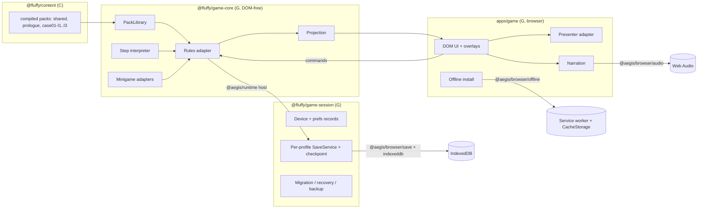

# Fluffy Bureau runtime architecture (Stage 1)

**Owner:** workstream G. **Status:** Stage 1 implementation, 2026-10-08.
**Engine:** AEGIS SDK pinned at `rumukh/aegis-engine` `0abd61b5a679` (see `vendor/aegis/README.md`).

## 1. Packages and responsibilities

| Package | Path | Depends on | Responsibility |
|---|---|---|---|
| `@fluffy/content` | `packages/content` (C) | — | Compiled, validated content packs (`docs/content/SCHEMA.md`). |
| `@fluffy/game-core` | `packages/game-core` | `@aegis/runtime`, `@aegis/narrative`, `@fluffy/content` | Authoritative state, commands and rules; step interpreter; minigame adapters; projection; autoplay for traces. No DOM, no clock, no `Math.random` (lint-enforced). |
| `@fluffy/game-session` | `packages/game-session` | `@aegis/browser/save`, `/checkpoint`, game-core | Profiles (T03), device and per-profile preference records, strict saves, content migration, recovery, backup import/export, one-window-per-profile lock. Storage and locks are injected, so it runs headlessly in tests. |
| `@fluffy/game` | `apps/game` | all above, `@aegis/browser/ui`, `/audio`, `/offline` | Browser UI, presenter adapter, narration, offline installation, parent corner, build/dev/preview scripts. |

## 2. Authoritative state on `@aegis/runtime`

- **One runtime host per profile.** State type `ProfileState` (`packages/game-core/src/state.ts`): avatar,
  learned skills, buttons/hearts, granted reward claim keys and IDs, office decor, facts, glossary,
  completed packs, lamp, run counter and the active `RunState`.
- **`RunState`** is the case in progress: pack ID and exact revision, scene, a *cursor* (indexes into
  nested step lists with the branch taken), interjection queue (replies, hints, explanations, help and
  comfort lines), visited scenes, flags, clues, the `@aegis/narrative` notebook, klubok usage, the active
  `@aegis/narrative` minigame instance, help suggestions, version attempts and stage cues.
- **Commands** (`GameAction`, all zero-turn): `avatar.*`, `start`, `next`, `choose`, `back`, `move`,
  `mark`, `help`, `accept`, `hint`, `version`, `lamp`, `await`, `decor`, `leave`, `import`.
  Each is validated by a schema, resolved once, applied atomically; illegal commands change nothing.
  The UI dispatches with `expectedRevision` = the revision it rendered, and commands are serialized,
  so a double tap or a stale button can never apply twice.
- **Runtime content** is a small *index* `{ packs: [{id, revision}] }`. Packs themselves are held by a
  `PackLibrary` keyed by content-addressed revision (C's sha256), so the runtime content hash covers
  them without putting 300 KB of JSON through runtime validation on every host creation.
- **Rewards** are granted once per `claimKey` per profile; the key is stored in state *and* claimed in
  the runtime ledger, so content migrations can never re-grant (Q38, Q40).

## 3. Narrative, deduction, notebook, hints and minigames

- **Scene flow** uses C's step language (agreed with C instead of `NarrativeGraph`): a deterministic
  interpreter (`interpreter.ts`) runs automatic steps (`dir`, `clue`, `set`, `reward`, `if`, `skill`,
  `goto`) until a blocking step (`line`, `menu`, `minigame`, `await`, `end`). Hub scenes are re-evaluated
  after every notebook mark (e.g. a ✔ in the prologue starts the guess tutorial).
- **Deduction and notebook** use `@aegis/narrative`: `createNotebook`, `setNotebookMark` (user and
  evidence marks), `restoreNotebook` (citations rechecked on restore). Contradictory stickers are allowed
  (Q14). «Помоги заполнить» (D03) follows C's `notebookHelp`: *suggest* mode proposes a sticker with its
  reason line and the child accepts it (an evidence mark with prerequisite-closed citations); *point*
  mode only names the clue to revisit. Help never places a sticker by itself.
- **Version check** («Приглашу на разговор» / «Сказать догадку») is offered at hubs while
  `logic.version.available` holds. A wrong selection plays intro → the first wrong value's explanation
  (column order) → outro, and nothing is lost (Q16). A right one enters `onSolved`.
- **Hints:** «Клубок» uses the first applicable rule not yet given; it spends one of `allowance` only
  when a rule applies and otherwise plays `review` for free. «Телефон-ракушка» (unlimited, absent on
  level 3) gives the first applicable rule.
- **Minigames** are custom `@aegis/narrative` `MinigameAdapter`s registered in a `MinigameRegistry`
  (`minigames.ts`): magnifier (Лупа), cocoa (Чашка какао), tracks (Кто наследил? + closing question),
  timeline (Лента времени), scent-pairs (Пары запахов + question), baker (Пекарь, integer eighths).
  Instances are persisted in the run; the result ID is consumed once through the runtime claim ledger.
  Wrong answers reply and stay non-punitive; there are no timers anywhere.

## 4. Saves (`@aegis/browser/save`, IndexedDB)

| Record (`gameId` / `profileId`) | Content | Written |
|---|---|---|
| `fluffy-bureau.device` / `device` | profile list (≤ 4: id, name, species, scarf), volumes, break interval | on change, CAS with re-read and retry |
| `fluffy-bureau.prefs` / `<profile>` | text scale 100–200 %, readable font, motion (system/calm/full), read choices aloud | on change |
| `fluffy-bureau` / `<profile>` | runtime snapshot envelope | **after every command** via the strict checkpoint bridge |

- **Autosave:** `createSaveCheckpoint` makes every commit durable before the next command; the save
  indicator shows only acknowledged state. A failed write is retried with `retryCheckpoint` (never by
  re-dispatching).
- **Resume mid-minigame:** the minigame instance and the notebook are part of the snapshot; reopening
  restores the exact view (unit traces check every node; E2E checks a browser reload and an offline
  cold start).
- **Cross-tab:** a Web Lock per profile (`acquireProfileLock`) lets only one window play a profile; the
  other shows «Игра открыта в другом окне.» with «Играть здесь», which takes the lock over (the first
  window then blocks). IndexedDB compare-and-swap is the second line of defence: a stale writer gets
  `conflict`, never a silent overwrite.
- **Recovery:** an unreadable or incompatible record opens a recovery screen (export the original bytes,
  restore the previous copy, or reset after confirmation) instead of a new game.
- **Content updates (Q43):** if a save's content revision is not the running one, the profile state is
  migrated (`migrateProfileJson`): profile progress is kept; a run whose pack revision changed restarts
  at the beginning of the same scene (C guarantees every scene is restart-safe).
- **Backup:** the parent corner exports a profile's stored envelope to a local file and imports a file
  into any profile (state extracted and migrated). No cloud, no network.

## 5. Narration (`@aegis/browser/audio`)

`Voice` (`apps/game/src/audio.ts`) registers every voiced line that has a recording in A's voice index,
per content pack, and plays the line that is newly on screen. Advancing stops it; nothing auto-advances;
«Повторить» replays; captions are always the on-screen text. Ear buttons speak choice labels; the
«Читать варианты вслух» preference queues labels after the prompt (T06). Lines without a recording show
«Без голоса: читай текст» — no fake success. Volumes are per bus (voice, music, effects). The audio
context is unlocked from the first trusted gesture (iPadOS).

## 6. UI

Plain DOM with a tiny element helper (`dom.ts`), re-rendered from the projection on every commit with
focus kept by `data-key`. Controls are native buttons from `createActionButton` (click-only activation for
mouse, touch, Enter and Space). Child-safe rules: 48 px targets, ≥ 22 px text scaled to 200 %, visible
focus, at most three primary choices per page with «Ещё варианты» paging, dialogs via `openDialog`
with focus restore, Escape closes overlays, `assertChildSafeView` on every render in release builds.
Fonts are bundled (Nunito; Andika as the readability option, T09). Reduced motion follows the system
unless the profile chooses otherwise. Portrait shows «Поверни планшет» (T02). Pause (runtime pause
reason `user`) is available on every game screen and also stops narration and stage animation;
visibility changes add the `visibility` reason.

## 7. Presentation adapter

`Presenter` (`apps/game/src/presenter.ts`) is the boundary for E's `@aegis/browser/stage`:
`show(scene)`, `speak(speaker, lineId)`, `setPaused`, `dispose`. Until E delivers puppets, lip-sync and
cutscenes, `StaticPresenter` shows A's layered still images on a letterboxed 2560×1600 logical stage
(background, per-level prop layers, cast, and the player's avatar whose scarf is tinted at runtime through
A's mask), with a cross-fade and compositor-only CSS motion (disabled under reduced motion). Hotspots use
the same logical coordinates. Music follows the location and switches to A's `-warm` variant under the
comfort lamp; sound effects mark finds, misses, cards, lamp, hearts and buttons. No animation
engine is implemented here. Mapping plan for E's API (from E0): `createStage` ↔ presenter construction,
`stage.puppet(...).speak(...)` ↔ `speak`, `stage.cutscene(json, { avatar })` for scenes with
`presentation: 'cutscene'`, completion committed by an ordinary runtime command.

## 8. Offline and updates (`@aegis/browser/offline`)

The build emits **incremental offline packs**: `shell` (code, styles, fonts, licences, shared content),
`prologue`, `case01` (later `case02`…). Each has a digest-checked resource graph
(`dist/offline/<pack>.json`); `dist/offline/index.json` lists the build. On first online start the app
installs every pack (all-or-nothing per pack) and registers the bundled worker, which pins exact
revisions, denies outbound requests, never skips waiting and never reloads a running case. A newer build
is installed side by side and takes over at the next launch; saves migrate as described in §4.

## 9. Privacy and release shell

No accounts, telemetry, analytics, outbound links or remote calls; a strict Content-Security-Policy
(`connect-src 'self'`, `frame-src 'none'`); no debug globals (E2E checks `window`); errors are shown
locally and only logged in the dev channel. The parent corner (T17: 3-second hold + two-digit ×
one-digit question) is text-only (Q29).

## 10. Build and verification

See `docs/architecture/WORKSPACE.md` for commands. Evidence lives in `docs/qa/STAGE1_ACCEPTANCE.md`.

## 11. Decisions taken by G

| ID | Decision | Why |
|---|---|---|
| G-D01 | Scene flow interprets C's step language rather than `NarrativeGraph`; deduction, notebook, hint data and minigames use `@aegis/narrative`. | One authored format, validated exhaustively by C; graph conversion added no safety. |
| G-D02 | Runtime content is a pack *index*; packs are resolved by content-addressed revision. | Keeps runtime validation bounded as cases 2–8 arrive. |
| G-D03 | A content update restarts an in-progress run at the start of the same scene. | Steps carry no stable keys; C guarantees restart safety. |
| G-D04 | Mechanics' HUD buttons (notebook, lamp, klubok, shell) appear in the prologue only after their first-encounter tutorial (R09). Pause is always present. | Teach one mechanic at a time. |
| G-D05 | `office.place` can also move an already placed item, so replaying case 1 never dead-ends. | Replays are allowed (Q38). |
| G-D06 | E2E runs serially (`workers: 1`). | Service-worker installation and persistent profiles are timing-sensitive under parallel load. |
