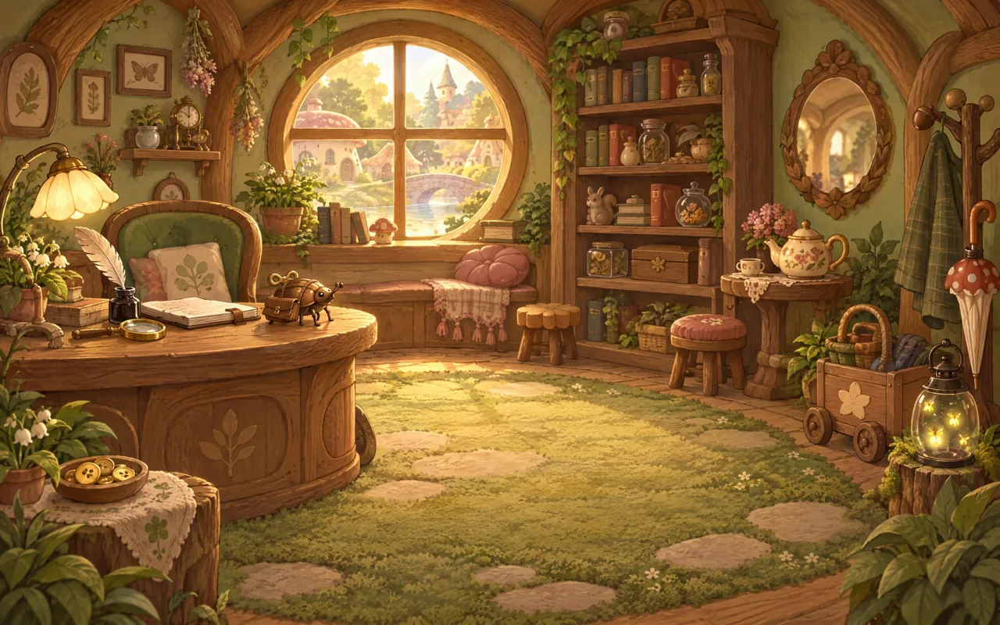
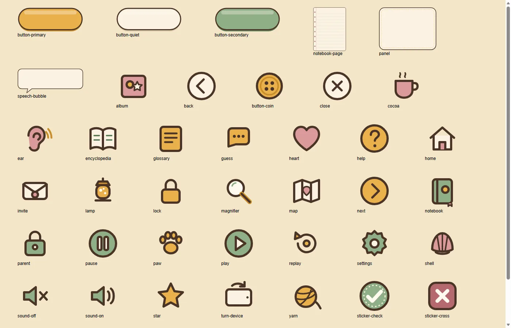
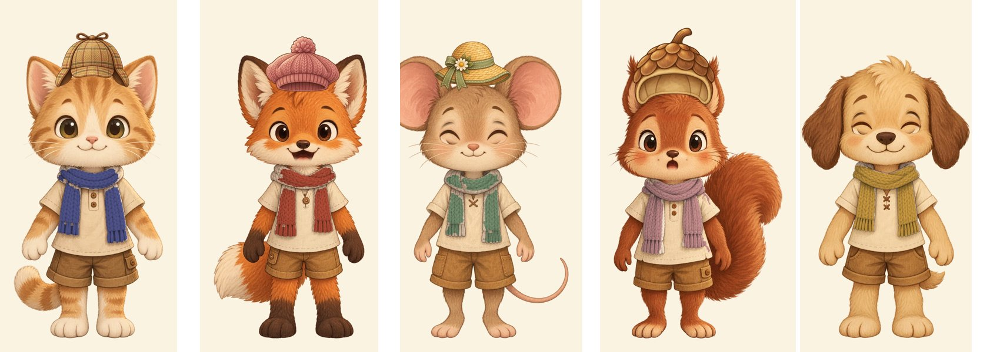

# Арт-гид «Пушистого бюро расследований»

**Версия:** 1, 8 октября 2026 года. **Ответственный:** workstream A (графика и звук).
**Основа:** ТЗ разделы 2–3, Q22, Q26–Q32, T05–T09, T19, T20, T23, план 5.4–5.7.

Этот гид — единый ориентир для иллюстраций, кукол, интерфейса и звука игры.
Иллюстрации делаются генерацией (Azure OpenAI `gpt-image-2.5-sunburst`, T07) с
опорными изображениями: стиль-кадр задаёт манеру, листы персонажей задают облик.
Затем идёт скриптовая доводка в `tools/assets/`.

## 1. Настроение

Уютный городок зверей, где все друг другу помогают. Утро, чай, пузыри, запах
пирогов. Загадка — это интересно, а не страшно.

- Тёплый золотистый свет из окон и фонарей-светлячков.
- Ничего острого: скруглены мебель, крыши, кнопки и рамки.
- Всё выглядит «потрогаемым»: ткань, дерево, мох, мёд, керамика.
- У героев большие глаза и мягкие улыбки.

## 2. Палитра

| Роль | Образец | HEX | Где |
|---|---|---|---|
| Мёд (тёплый основной) |  | `#e8b04a` | свет, кнопки действия, награды |
| Мёд тёмный | | `#c98d2a` | тени мёда, кант кнопок |
| Шалфей (спокойный основной) |  | `#8fae86` | стены, мох, кнопки «дальше», ✔ |
| Шалфей тёмный | | `#5f7f58` | тени шалфея |
| Пыльная роза |  | `#d99a9a` | ткани, ракушка, сердечки |
| Роза тёмная | | `#b5686d` | ✖, кант розовых элементов |
| Сливки (фон панелей) |  | `#fbf3e2` | панели, Блокнот, реплики |
| Чернила (контур и текст) |  | `#4a3426` | контуры, весь текст |
| Черника (акцент дела №1) | | `#5b5f9e` | лапы Тёпы, мыло, ягоды |

**Правила.** Чистый чёрный не используется: контуры и текст — тёмно-коричневые
«чернила». Насыщенные цвета — только мелкими акцентами. Фон сцены всегда спокойнее
героев и активных предметов.

## 3. Линия, форма, фактура, свет

- **Контур:** мягкий тёмно-коричневый, средней толщины, «кисточкой».
- **Формы:** круглые и пухлые; силуэт героя читается по пятну.
- **Фактура:** гуашь и акварель, лёгкое зерно бумаги. Без фотореализма и 3D-блеска.
- **Свет:** тёплый, сверху-сбоку, мягкие тени без чёрного. В сумерках (дела 3, 5, 7)
  в кадре всегда есть источник света (Q22).

## 4. Вита-панк: уютные технологии

| Предмет | Как выглядит |
|---|---|
| Заводной почтовый жук | медный круглый панцирь с заклёпками, латунный ключик, прозрачные крылышки, несёт конверт |
| Фонари-светлячки | латунный фонарь со стеклянным шаром, внутри мягко светятся светлячки |
| Печки на медовой карамели | скруглённая кирпичная печь, угли светятся золотом, сладкое облачко из трубы |
| Улитка-трамвай | вагончик в виде улиточьего домика на рельсах |
| Зонты-мухоморы | красная в белый горошек шляпка, деревянная ручка |
| Моховые ковры | круглые ковры из мха с камешками-ступеньками |
| Монетки-пуговки | деревянные пуговицы с четырьмя дырочками и медовым ободком |
| Телефон-ракушка | перламутровая розовая ракушка на деревянной подставке с латунным диском |
| Волшебный клубок | медовый клубок шерсти, нитка светится |
| Часы с окошками (пекарня) | латунный циферблат без цифр, вокруг пять арочных окошек со ставнями |

## 5. Персонажи

Листы персонажей — в `model-sheets/` (уменьшенные копии; мастера — в
`F:\AI\GameAssets\fluffy-bureau\characters\`). Лист — облик-эталон: три ракурса во весь
рост, четыре эмоции, палитра.

| Герой | Главные приметы (не менять) |
|---|---|
| Шерлок Хвостс, дедушка-барсук | серебристо-серый, чёрно-белые полосы на морде, твидовая кепка, шалфейный жилет, розовая бабочка, часы на цепочке. Думая, пускает мыльные пузыри (не курит) |
| Доктор Ватсони, ежиха | мягкие светло-коричневые иголки, круглые золотые очки **на макушке**, розовый кардиган, сливочный фартук с шалфейным крестиком |
| Мэр Пудинг, хомяк | очень круглый, золотисто-кремовый, **надутые щёки**, бордовый цилиндр с цветком, шалфейный сюртук, медовая лента с пуговицей-медалью |
| Тёпа, енот-мыловар | серый, тёмная маска, полосатый хвост, **синие черничные лапы**, фартук с пузырями, розовая рубашка, шалфейный платок |
| Стелла, сорока-почтальон | чёрно-белая с сине-зелёным отливом, медовая фуражка с конвертом, розовая сумка через плечо |
| Картофан, крот-садовник | угольный бархатный мех, длинный розовый нос, широкие лапы-лопатки, **всегда щурится**, соломенная шляпа, медовый комбинезон с ростком |
| Дамка, бобёрша-инженер, смотритель маяка | каштановая, плоский хвост, два больших зуба, латунные гогглы на лбу, медовый плащ, ремень с ключом и фонарём |
| Шуршики, мышата | серо-коричневые, большие розовые уши; мальчик — шалфейная кепка и медовый жилет; девочка — розовый платок и сливочное платьице |
| Фитилёк, светлячок-фокусник | круглая голова, большие глаза, светящиеся кончики усиков, медовый цилиндр, розовый плащ, **светящееся брюшко** |
| Пухлик, совёнок-стажёр | пушистый серый, огромные янтарные глаза, шалфейный шарф с ромашкой. В Этапе 1 не появляется |

**Аватар игрока** (T05): котёнок, лисёнок, мышонок, бельчонок, щенок. Одежда у всех
одинаковая — сливочная туника и коричневые шорты. Шарфик написан светло-серым и
тонируется в игре; шапок на основе нет, они — отдельные слои. Голова крупная, около
трети роста. Пол не обозначается (D05).

## 6. Куклы

Формат — `aegis-rig/1` и `aegis-atlas/1` от workstream E (`docs/api/animation.md` в
`rumukh/aegis-engine`). Сборка — `tools/assets/art/puppet.py`, подробности — в
`docs/art/PUPPETS.md`.

- Основа — одна фигура в строгом фас, руки чуть отведены.
- Глаза (открыты, полуприкрыты, закрыты; у аватара ещё «улыбка»), брови (обычные,
  удивлённые, встревоженные) и рот X, A–F получаются **маскированной правкой** той же
  головы и вырезаются мягкой маской. Пиксели вне маски в игру не попадают, поэтому лицо
  не «плывёт».
- Части: `body`, `head`, `eyes`, `brows`, `mouth`; у аватара — `scarf` с каналом
  тонировки `scarf`, слот `hat` и якорь `badge`.
- **Части всех пяти видов аватара называются одинаково**, поэтому клипы общие.
- Масштаб — 0,6 от мастера: взрослый герой ростом около 800 логических пикселей в сцене
  2560×1600. Опорная точка — между ступнями.
- Формы рта G и H не рисуются: по контракту E они заменяются на B и C.

## 7. Фоны

- 2560×1600 (16:10), WebP. Всё важное — в безопасной зоне 2100×1440 в центре (отступы
  230 px по бокам и 80 px сверху и снизу): она видна и на 4:3, и на 16:9.
- Нижняя треть кадра спокойная: там стоят герои и аватар.
- Активные предметы крупные (от ~120 логических пикселей) и хорошо отделены от фона.
- Огород и сарай на сложности 3 — **два явно разных места**: огород впереди, сарай —
  за шалфейной калиткой и забором (открытый вопрос из `SCRIPT_CASE01_LEVELS23_RU.md`).
- Коробка мэра — сливочная, с медовой лентой и **круглым окошком в крышке**, в нём
  виден пирог (R03). Коробка с рассадой такая же, но с землёй и ростками.

## 8. Интерфейс

- Иконки — SVG 96×96, контур 6 px «чернилами», скругления; читаются от 48 px.
- Кнопки — «пилюли»: медовая (действие), шалфейная (дальше), сливочная (тихая).
  Подпись — всегда текстом и голосом (кнопка-ушко рядом).
- Панели — сливочные, скругление 44 px, пунктирная медовая рамка.
- **Контраст текста «чернилами» `#4a3426`:** на сливках — 10,5:1, на мёде — 5,9:1,
  на розе — 5,0:1, на шалфее — 4,7:1. На тёмной розе `#b5686d` текст не пишется
  (2,9:1): там только белые значки. Текст поверх иллюстраций — только на панели
  (план 5.6, не ниже 4,5:1).
- **Стикеры Блокнота различаются формой, а не только цветом** (Q10): ✔ — круглая
  шалфейная печать, ✖ — скруглённый розовый квадрат, ? — медовое облачко.
- Шрифты: Nunito, вариант читаемости Andika (T09); подключает G.
- Зона нажатия — не меньше 64 логических пикселей.

## 9. Эффекты

Мыльные пузыри (Хвостс думает), искорки (находка), светлячки (лампа, сумерки), пар над
какао. Всё медленное и мягкое. При «спокойной анимации» эффекты не летают, а
появляются и тают на месте.

## 10. Не страшно (Q22)

Допустимо: сумерки с огоньками, мягкий силуэт, тихое шуршание.
**Недопустимо:** резкие контрасты, темнота без источника света, оскал, когти как
оружие, красные глаза, резкие звуки, скримеры. «Лампа смелости» добавляет тёплый свет
поверх сцены (это делает G), поэтому отдельные светлые фоны не нужны.

## 11. Звук

См. `docs/audio/AUDIO_GUIDE_RU.md`.

## 12. Где что лежит

| Что | Где |
|---|---|
| Игровые файлы | `assets/`, манифест — `assets/manifest.json` |
| Исходники и черновики | `F:\AI\GameAssets\fluffy-bureau\` (вне репозитория, T20) |
| Запросы генерации | `tools/assets/art/prompts/` |
| Инструменты | `tools/assets/` |
| Происхождение и лицензии | `assets/manifest.json`, `docs/art/CREDITS_RU.md` |

## 13. Этап 2 (дела 2–4): что добавилось

- **Сумерки и ночь (дело 3):** небо сиреневое и персиковое, никогда не чёрное; в каждом ночном
  кадре есть не меньше трёх тёплых огоньков (фонари, окна, светлячки). Маяк — красно-белый, с
  тёплым медовым светом, а не холодным лучом.
- **Погреб мэра (дело 4):** освещён на каждой ступени, банки с бантиками и клетчатыми крышками;
  тёмных углов нет.
- **Шифр (дело 2):** четыре цвета палитры (мёд, голубой, розовый, шалфей) × четыре формы
  (круг, квадрат, цветок, сердце) × 1–4 дырочки. Цвет никогда не единственный признак: форма и
  число дырочек различимы и в оттенках серого.
- **Звуки-улики без звука:** волна, подпись и значки громкости, высоты, длины и ритма
  (`assets/sound-clues/`), всё в стиле UI-кита.
- **Лавка (T29):** шапки (помпон, капитанка, венок, цилиндр), узоры шарфов (полоски, горошек,
  сердечки, звёздочки — серые, тонируются как шарф), украшения Конторы.
- **Новые герои:** бобриха Дамка (жёлтый дождевик, зелёный комбинезон, фонарик на поясе) и совёнок Пухлик
  (белый пух, зелёный шарфик, огромные глаза); листы — в `docs/art/model-sheets/`.
