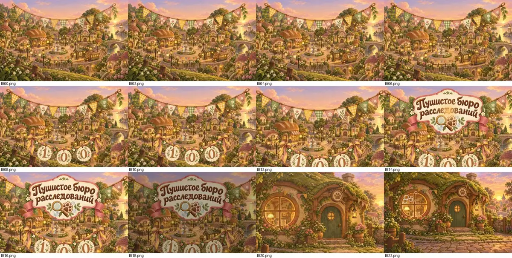
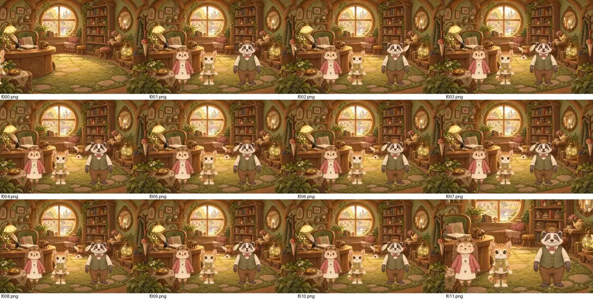
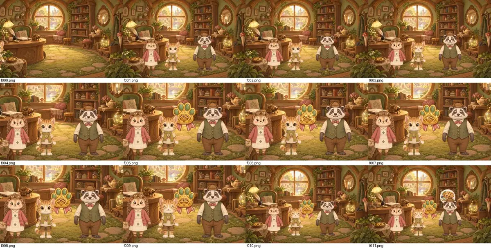
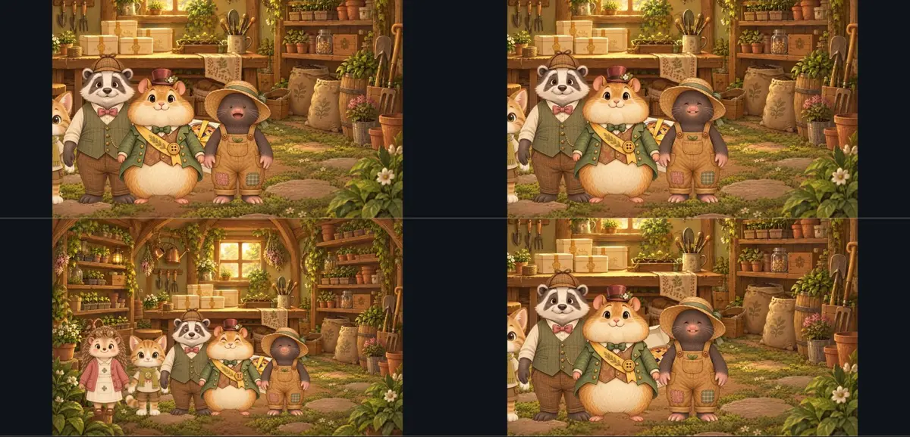
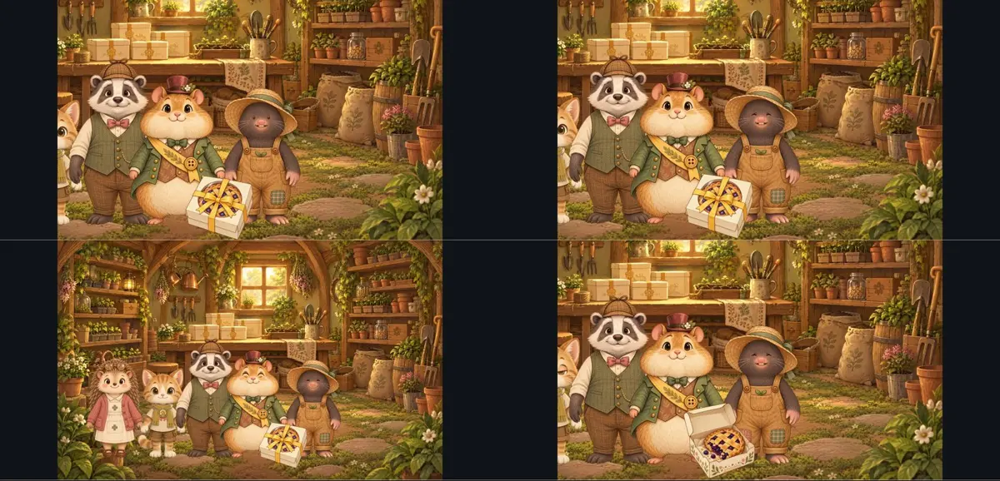
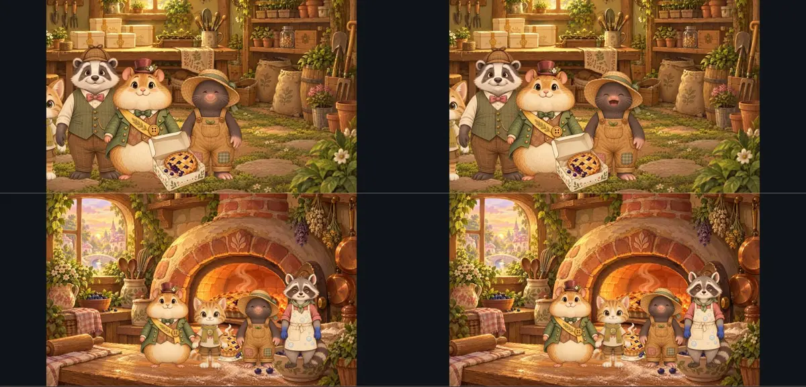

# Проверка роликов Этапа 1 в предпросмотре E

**Дата:** 8 октября 2026 года. **Ролики:** C, ветка `rumukh-fluffy-content-cutscenes`,
коммит `39f49de`. **Ассеты:** A, `ca66031`. **Предпросмотр:** лаборатория анимации E
(`rumukh-fluffy-bureau-engine-extensions`, `17ed4be`), Chromium без окна.

## Как проверяли

1. `aegis-animation validate` на всех ригах, клипах и 11 роликах.
2. Каждый ролик загружен в лабораторию отдельно, только со своим составом
   (`tools/assets/art/preview_manifest.py`).
3. Ролик проигран до конца скриптом (`tools/assets/art/record_cutscene.mjs`): скрипт
   нажимал «Дальше», когда ролик ждал игрока, и сохранял кадр каждые 0,8 с.
4. P3 проигран ещё раз со спокойной анимацией и «Лампой смелости».

Предпросмотр E знает только камеру `close`. Поэтому в копиях для предпросмотра
пресеты `close-left`, `close-center`, `close-right` и `sky` заменены точками из
`apps/game/src/presenter.ts` (G). Документы C не менялись.

## Итог

| Ролик | Валидатор | До конца | Реплик | Ошибок страницы | Замечания |
|---|---|---|---|---|---|
| `intro` | 0 | да | 0 | 0 | — |
| `p3.letter` | 0 | да | 3 | 0 | — |
| `c1.shed.l1` | 0 | да | 19 | 0 | **коробку закрывают герои** (ниже) |
| `c1.shed.l2` | 0 | да | 22 | 0 | то же |
| `c1.shed.l3` | 0 | да | 24 | 0 | то же |
| `c1.oven.l1`–`l3` | 0 | да | 2 | 0 | мелочь: пирог-проп поверх печи |
| `c1.reward.l1`–`l3` | 0 | да | 2 | 0 | — |

Работает как задумано:

- губы двигаются по дорожкам;
- «Дальше» после каждой реплики;
- мыльные пузыри, искорки, конфетти, пар и свечение;
- эмоция `joy` у аватара;
- значок на шарфике после вручения;
- смена закрытой коробки на открытую;
- стикер с нужным числом звёзд;
- спокойная анимация и тёплый свет «Лампы».





## Замечания

### 1. Коробку мэра в сарае почти не видно (все три сложности) — важно

Коробка стоит в точке x 1500, y 1300. Ряд героев стоит на полу y 1450: Пудинг у
x 1300, Картофан у x 1700–1850. Герои сортируются по y, поэтому стоят перед
коробкой. Видны только край крышки и бант. Момент «пирог съехал набок» (C1-7-08) в
кадре почти не читается.



**Предложение для C:** поставить коробку перед рядом, например x 1500, y 1520. Ножки
героев на y 1450, поэтому коробка окажется впереди. Либо отвести Пудинга и Картофана
в стороны (x ≤ 1150 и x ≥ 1850) на время сцены с коробкой.

Проверено в лаборатории: с коробкой в x 1500, y 1520 ролик `c1.shed.l1` проходит до конца без ошибок, коробка с пирогом в окошке и открытая коробка со съехавшим пирогом видны целиком.

 Одно и то же правится в
`c1.shed.l1`, `l2` и `l3` (шаги `box`, `boxOpen`).

### 2. Пирог-проп поверх печи (C1-8) — мелочь

`prop.pie-baked` появляется в x 760, y 1080 — над горшками на подоконнике слева от
печи. На фоне `bg.bakery-oven` свободный стол перед печью — x 1300–1900, y 1300–1420.
Предложение: x 1500, y 1400, тогда пирог стоит на столе.

## Повторная проверка (C 7f1b84b)

C перенёс коробку в x 1500, y 1520 и пирог в x 1500, y 1400. Валидатор: 0 ошибок на 11 роликах. Ролики `c1.shed.l1`–`l3` и `c1.oven.l1`–`l3` перезаписаны: все доходят до конца без ошибок. Открытая коробка со съехавшим пирогом видна целиком. Пирог стоит на столе у печи. Его слегка перекрывают аватар и Картофан — это допустимо. Если нужно, пирог можно поставить на y 1470, перед героями.



**Итог:** все 11 роликов Этапа 1 приняты художественной частью.

## Как повторить

```powershell
python tools/assets/art/preview_manifest.py <папка с роликами> <папка вывода>
cd <aegis-engine>; npm run preview:labs -- --dir out\labs --consumer <папка вывода>
# http://127.0.0.1:4318/animation-lab/?manifest=../consumer/manifest.json
node tools/assets/art/record_cutscene.mjs <url> <id ролика> <папка кадров> [--reduced] [--comfort]
```


## Этап 2 (дела 2–4), 9 октября 2026

39 роликов C (коммит `132c205`): `aegis-animation validate` с ригами A — 0 ошибок, 0 предупреждений.
Все проиграны в лаборатории E до конца без ошибок исполнения; кадры —
`F:\AI\GameAssets\fluffy-bureau\lab-s2-rec\<id>\`.

Замечания отправлены C:

| Ролики | Что | Предложение |
|---|---|---|
| `c2/c3/c4.reward.l1–l3` | значок, стикер и третий проп наезжают друг на друга и на голову Хвостса | Хвостс x 1800; значок (1080, 860); стикер после ухода значка или в 380 px от него; третий проп после ухода обоих |
| `c2.oak.l1–l3` | на `close-right` голова Стеллы уходит за верх кадра; проп гнезда закрыт Стеллой | Стелла y ≈ 1150; гнездо убрать или поставить (1850, 340) |
| `c4.pantry.l1–l3` | двенадцать банок — главный предмет, но их закрывают Хвостс и Пудинг; Пухлик обрезан справа | банки (1280, 1050) или шире расставить героев; Пухлик x 2050 |

Лаборатория E загружает все документы одного каталога сразу под бюджет 96 МиБ, поэтому для
предпросмотра — не больше трёх фонов на каталог (дело 4 разделено на два).
